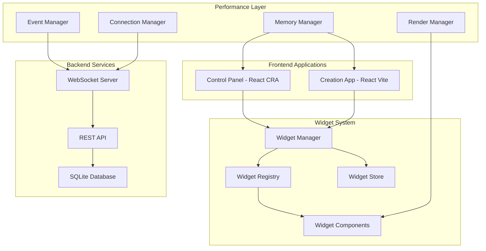

# Design Document

## Overview

This design addresses critical performance issues in both the creation (R1 client) and control panel applications while implementing a modern, widget-based architecture. The solution focuses on eliminating memory leaks, implementing efficient real-time updates, and providing a highly customizable user experience through a comprehensive widget system.

## Architecture

### High-Level Architecture



### Performance Optimization Strategy

The performance issues stem from several sources identified in the current codebase:

1. **Memory Leaks in Socket Connections**: Improper cleanup of event listeners and intervals
2. **Excessive Re-renders**: Lack of proper memoization and state management
3. **Inefficient Event Handling**: Multiple event listeners without proper cleanup
4. **Large Bundle Sizes**: Monolithic components without code splitting

## Components and Interfaces

### 1. Performance Management Layer

#### Memory Manager
```typescript
interface MemoryManager {
  trackComponent(componentId: string, cleanup: () => void): void
  untrackComponent(componentId: string): void
  forceGarbageCollection(): void
  getMemoryUsage(): MemoryStats
}

interface MemoryStats {
  heapUsed: number
  heapTotal: number
  componentCount: number
  listenerCount: number
}
```

#### Event Manager
```typescript
interface EventManager {
  subscribe(event: string, handler: EventHandler, options?: EventOptions): string
  unsubscribe(subscriptionId: string): void
  emit(event: string, data: any): void
  cleanup(): void
}

interface EventOptions {
  once?: boolean
  debounce?: number
  throttle?: number
}
```

#### Connection Manager
```typescript
interface ConnectionManager {
  connect(): Promise<void>
  disconnect(): void
  reconnect(): Promise<void>
  getStatus(): ConnectionStatus
  onStatusChange(callback: (status: ConnectionStatus) => void): void
}

enum ConnectionStatus {
  CONNECTING = 'connecting',
  CONNECTED = 'connected',
  DISCONNECTED = 'disconnected',
  RECONNECTING = 'reconnecting',
  ERROR = 'error'
}
```

### 2. Widget System Architecture

#### Widget Registry
```typescript
interface WidgetRegistry {
  register(widget: WidgetDefinition): void
  unregister(widgetId: string): void
  getWidget(widgetId: string): WidgetDefinition | null
  getAllWidgets(): WidgetDefinition[]
  getWidgetsByCategory(category: string): WidgetDefinition[]
}

interface WidgetDefinition {
  id: string
  name: string
  description: string
  category: WidgetCategory
  component: React.ComponentType<WidgetProps>
  configSchema: JSONSchema
  defaultConfig: WidgetConfig
  minSize: WidgetSize
  maxSize: WidgetSize
  resizable: boolean
  version: string
}

enum WidgetCategory {
  MONITORING = 'monitoring',
  CONTROL = 'control',
  COMMUNICATION = 'communication',
  ANALYTICS = 'analytics',
  CUSTOM = 'custom'
}
```

#### Widget Manager
```typescript
interface WidgetManager {
  createWidget(widgetId: string, config: WidgetConfig): Promise<WidgetInstance>
  updateWidget(instanceId: string, config: Partial<WidgetConfig>): Promise<void>
  removeWidget(instanceId: string): Promise<void>
  getWidget(instanceId: string): WidgetInstance | null
  getAllWidgets(): WidgetInstance[]
  saveLayout(layout: LayoutConfig): Promise<void>
  loadLayout(): Promise<LayoutConfig>
}

interface WidgetInstance {
  id: string
  widgetId: string
  config: WidgetConfig
  position: WidgetPosition
  size: WidgetSize
  visible: boolean
  locked: boolean
}
```

#### Widget Store (State Management)
```typescript
interface WidgetStore {
  // Widget data management
  setWidgetData(instanceId: string, data: any): void
  getWidgetData(instanceId: string): any
  subscribeToWidgetData(instanceId: string, callback: (data: any) => void): string
  
  // Real-time updates
  updateWidgetData(instanceId: string, updates: Partial<any>): void
  broadcastUpdate(event: string, data: any): void
  
  // Configuration management
  updateWidgetConfig(instanceId: string, config: Partial<WidgetConfig>): void
  getWidgetConfig(instanceId: string): WidgetConfig
}
```

### 3. Navigation System

#### Swipe Navigation Manager
```typescript
interface SwipeNavigationManager {
  registerPage(page: PageDefinition): void
  navigateToPage(pageId: string, animated?: boolean): void
  getCurrentPage(): string
  onPageChange(callback: (pageId: string) => void): void
  enableSwipeGestures(enabled: boolean): void
}

interface PageDefinition {
  id: string
  name: string
  component: React.ComponentType
  icon?: string
  order: number
}
```

### 4. Widget Development Kit

#### Widget SDK
```typescript
interface WidgetSDK {
  // Data access
  getData(): Promise<any>
  setData(data: any): Promise<void>
  subscribeToData(callback: (data: any) => void): string
  
  // Configuration
  getConfig(): WidgetConfig
  updateConfig(config: Partial<WidgetConfig>): Promise<void>
  
  // Communication
  emit(event: string, data: any): void
  on(event: string, callback: (data: any) => void): string
  
  // UI utilities
  showNotification(message: string, type: NotificationType): void
  openModal(component: React.ComponentType, props?: any): void
  
  // Device integration
  getDeviceInfo(): DeviceInfo
  sendCommand(command: string, params?: any): Promise<any>
}
```

## Data Models

### Widget Configuration Schema
```typescript
interface WidgetConfig {
  // Visual configuration
  theme: WidgetTheme
  colors: ColorScheme
  typography: TypographyConfig
  
  // Behavior configuration
  updateInterval: number
  autoRefresh: boolean
  showHeader: boolean
  showBorder: boolean
  
  // Data configuration
  dataSources: DataSource[]
  filters: FilterConfig[]
  
  // Custom configuration (widget-specific)
  custom: Record<string, any>
}

interface WidgetTheme {
  variant: 'light' | 'dark' | 'auto'
  accentColor: string
  borderRadius: number
  shadow: boolean
}

interface DataSource {
  id: string
  type: 'websocket' | 'rest' | 'mcp' | 'static'
  endpoint: string
  params: Record<string, any>
  transform?: string // JavaScript function as string
}
```

### Layout Configuration
```typescript
interface LayoutConfig {
  id: string
  name: string
  widgets: WidgetLayoutItem[]
  grid: GridConfig
  responsive: ResponsiveConfig
}

interface WidgetLayoutItem {
  instanceId: string
  position: WidgetPosition
  size: WidgetSize
  zIndex: number
}

interface GridConfig {
  columns: number
  rows: number
  gap: number
  cellSize: number
}

interface WidgetPosition {
  x: number
  y: number
}

interface WidgetSize {
  width: number
  height: number
}
```

## Error Handling

### Performance Monitoring
```typescript
interface PerformanceMonitor {
  startMonitoring(): void
  stopMonitoring(): void
  getMetrics(): PerformanceMetrics
  onThresholdExceeded(callback: (metric: string, value: number) => void): void
}

interface PerformanceMetrics {
  memoryUsage: number
  cpuUsage: number
  renderTime: number
  bundleSize: number
  networkLatency: number
  errorCount: number
}
```

### Error Recovery System
```typescript
interface ErrorRecoverySystem {
  registerErrorBoundary(componentId: string, fallback: React.ComponentType): void
  handleError(error: Error, componentId: string): void
  recoverFromError(componentId: string): void
  getErrorHistory(): ErrorRecord[]
}

interface ErrorRecord {
  timestamp: Date
  componentId: string
  error: Error
  recovered: boolean
  recoveryTime?: number
}
```

## Testing Strategy

### Performance Testing
1. **Memory Leak Detection**: Automated tests to detect memory growth over time
2. **Render Performance**: Measure component render times and re-render frequency
3. **Bundle Size Analysis**: Monitor JavaScript bundle sizes and loading times
4. **Real-time Update Performance**: Test widget update latency and throughput

### Widget Testing Framework
```typescript
interface WidgetTestUtils {
  renderWidget(widgetId: string, config: WidgetConfig): WidgetTestInstance
  simulateDataUpdate(data: any): void
  simulateConfigChange(config: Partial<WidgetConfig>): void
  measureRenderTime(): number
  getMemoryUsage(): number
}
```

### Integration Testing
1. **Cross-Application Sync**: Test real-time synchronization between control panel and creation app
2. **WebSocket Reliability**: Test connection stability and automatic reconnection
3. **Widget Communication**: Test inter-widget communication and data sharing
4. **Swipe Navigation**: Test gesture recognition and page transitions

## Implementation Architecture Details

### Memory Optimization Strategies

1. **Component Lifecycle Management**
   - Implement automatic cleanup of event listeners on unmount
   - Use WeakMap for component references to prevent memory leaks
   - Implement component pooling for frequently created/destroyed widgets

2. **Event System Optimization**
   - Centralized event manager with automatic cleanup
   - Debounced and throttled event handlers
   - Event delegation for improved performance

3. **State Management Optimization**
   - Implement selective re-rendering using React.memo and useMemo
   - Use context providers with split state to minimize re-renders
   - Implement virtual scrolling for large lists

### Widget System Implementation

1. **Dynamic Loading**
   - Lazy load widget components using React.lazy
   - Implement code splitting at the widget level
   - Cache loaded widgets to prevent re-downloading

2. **Real-time Updates**
   - WebSocket-based real-time data streaming
   - Efficient diff algorithms for data updates
   - Batch updates to minimize render cycles

3. **Customization Engine**
   - JSON Schema-based configuration validation
   - Visual configuration editor with live preview
   - Theme system with CSS custom properties

### Navigation System Implementation

1. **Swipe Gesture Recognition**
   - Touch event handling with momentum calculation
   - Configurable swipe thresholds and sensitivity
   - Smooth animations using CSS transforms

2. **Page Management**
   - Virtual page system to minimize DOM nodes
   - Preloading of adjacent pages for smooth transitions
   - History management for browser back/forward support

### Cross-Application Integration

1. **Shared State Management**
   - WebSocket-based state synchronization
   - Conflict resolution for concurrent updates
   - Offline support with sync on reconnection

2. **Configuration Sync**
   - Real-time widget configuration synchronization
   - Version control for configuration changes
   - Rollback capability for failed updates

This design provides a comprehensive foundation for eliminating performance issues while implementing a powerful, extensible widget system that enhances user experience and developer productivity.